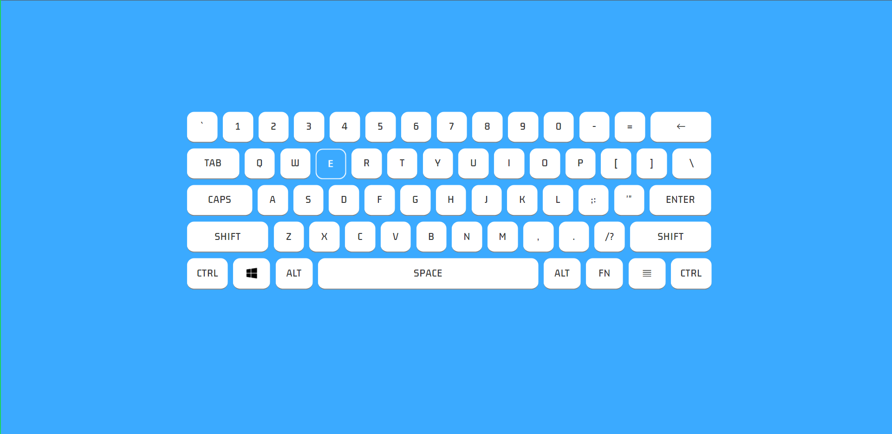

# Jiggly-Keyboard-Game

O desafio era construir um teclado que atendesse aos seguintes requisitos:

+ Os usuários veem o teclado do computador centralizado na página
+ Uma letra aleatória começará a balançar.
+ O usuário deve digitar a mesma chave que está balançando e ela irá parar.
+ Uma nova chave aleatória começará a balançar

O link do site está aq -> 
https://guilherme-brito-dac.github.io/Jiggly-Keyboard-Game/

